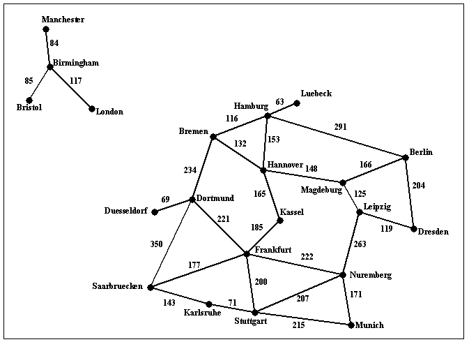

# route_finder
This is Implemention of **[A * search](https://en.wikipedia.org/wiki/A*_search_algorithm)** algorithm that can find a route between any two cities. 

### Graph ###

<p align="left">
  
</p>  


### Usage ###

The program will take exactly commandline arguments as follows:


**main_file input_filename origin_city destination_city heuristic_filename**

An example command line is:

``` 
main.py input1.txt Munich Berlin (For doing Uninformed search) 
```
**or**
```
main.py input1.txt Munich Berlin h_kassel.txt (For doing Informed search) 
```

### Description ###

The program will compute a route between the origin city and the destination city, and will print out both the length of the route and the list of all cities that lie on that route. It should also display the number of nodes expanded. For example,

```main.py input1.txt Bremen Kassel```
should have the following output:
```
nodes expanded: 8
distance: 297 km
route:
bremen to hannover, 132 km
hannover to kassel, 165 km 
```
and
```main.py input1.txt London Kassel```
should have the following output:
```
nodes expanded: 5
distance: infinity
route: none
```

If a heuristic file is provided then program perform Informed search. The heuristic file gives the estimate of what the cost could be to get to the given destination from any start state (note this is just an estimate). In this case the command line would look like

```
main.py input1.txt Munich Kassel h_kassel.txt
```

Here the last argument contains a text file what has the heuristic values for every state wrt the given destination city (note different destinations will need different heuristic values). For example, you have been provided a sample file `h_kassel.txt` which gives the heuristic value for every state (assuming kassel is the goal). The program uses this information to reduce the number of nodes it ends up expanding. Other than that, the solution returned by the program is same as the uninformed version. For example,

```find_route input1.txt Bremen Kassel h_kassel.txt``` should have the following output:

```
nodes expanded: 3
distance: 297 km
route:
bremen to hannover, 132 km
hannover to kassel, 165 km 
```

